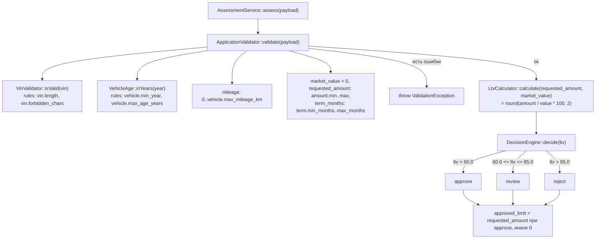

# Как считается решение

## Участвующие файлы

| Файл | Роль |
|---|---|
| `backend/src/Domain/AssessmentService.php` | Оркестратор: валидация → LTV → решение |
| `backend/src/Domain/ApplicationValidator.php` | Валидация полей заявки по справочнику |
| `backend/src/Domain/VinValidator.php` | Формат VIN |
| `backend/src/Domain/VehicleAge.php` | Возраст авто (текущий год − год выпуска) |
| `backend/src/Domain/LtvCalculator.php` | Расчёт LTV |
| `backend/src/Domain/DecisionEngine.php` | approve / review / reject по LTV |
| `backend/config/rules.php` | Все числа (пороги, лимиты) |
| `backend/src/Domain/ValidationException.php` | Ошибки валидации |

Пороги из `rules.php` попадают в классы через конструкторы — сборка в `backend/src/AppFactory.php` (например, `new DecisionEngine($rules['ltv'])`, строка 37).

## Порядок вызовов (в `AssessmentService::assess()`, строки 28–42)

1. **`ApplicationValidator::validate($payload)`** — нормализует и проверяет каждое поле по `rules.php`; при любой ошибке бросает `ValidationException`, до расчёта решения дело не доходит. Возвращает массив `input` с уже целочисленным `mileage`.
2. **`LtvCalculator::calculate($input['requested_amount'], $input['market_value'])`** — LTV в процентах с двумя знаками.
3. **`DecisionEngine::decide($ltv)`** — единственное место, где рождается решение: `ltv < approve_max (60.0)` → `approve`; `ltv <= review_max (85.0)` → `review`; иначе `reject`.
4. Формируется ответ: `vehicle_age` (снова через `VehicleAge::inYears`), `ltv`, `decision`, `approved_limit` (равен запрошенной сумме только при `approve`, иначе 0).

Факт на полях: докблоки в `rules.php` (строки 38–41) и в `DecisionEngine` обещают `LTV <= approve_max -> approve`, но код в строке 32 использует строгое `<` — при LTV ровно 60.0 код вернёт `review`, а не `approve`.

# Куда встанет правило «пробег ≤ 400 000 км, иначе review»

**Функция:** `DecisionEngine::decide()` — это единственное место в Domain, где присваивается `review`. Логичная точка — после ветки approve (строка 33), чтобы «понижать» approve до review при перепробеге. Но это семантика «уточнения»: правило в таком месте не тронет уже выданный `reject`. Если же правило читать буквально («пробег > 400 000 → решение review» безусловно), проверку надо ставить **до** LTV-веток — тогда она перекроет и `reject`. В коде этой логики нет, выбор семантики за реализующим.

**Что для этого уже есть:**
- Нормализованный `$input['mileage']` (int, уже проверен на 0–500 000) — доступен прямо в месте вызова: `AssessmentService.php`, строка 33, где сейчас `$this->decisionEngine->decide($ltv)`.
- Структура конфига `rules.php` — новое число по конвенции проекта кладётся туда, а не в код.
- Механизм передачи порогов в `DecisionEngine` через конструктор (сборка в `AppFactory.php:37`).

**Чего не хватает:**
- Самого числа 400 000 в `rules.php` — его там нет; существующий `vehicle.max_mileage_km = 500 000` имеет другой смысл (граница валидации) и не подходит.
- У `DecisionEngine::decide()` сигнатура `decide(float $ltv): string` — пробег в него не передаётся. Нужно расширить сигнатуру (второй параметр или весь input) и передать `$input['mileage']` из `AssessmentService::assess()`.
- У конструктора `DecisionEngine` тип только `array{approve_max, review_max}` — новый порог нужно добавить в конфиг, в конструктор и в сборку в `AppFactory`.
- Тестов на такое правило нет.

# Что сейчас проверяется про пробег

- `rules.php:23` — `vehicle.max_mileage_km = 500000` (единственное число по пробегу в конфиге).
- `ApplicationValidator.php:43–46` — приведение к int (если поле отсутствует, подставляется −1) и проверка `0 <= mileage <= 500000`; нарушение → ошибка валидации → `ValidationException` (заявка не доходит до расчёта решения).
- `ApplicationRepository.php:38–45` — пробег сохраняется в таблицу `vehicles` при записи заявки; это хранение, не проверка.

Влияния пробега на LTV, на решение или на лимит — **нет**. После валидации пробег просто переносится в `input` и в ответ сервиса. Других проверок пробега (например, на «скрученность», среднегодовой пробег, связь с возрастом) — **нет**.